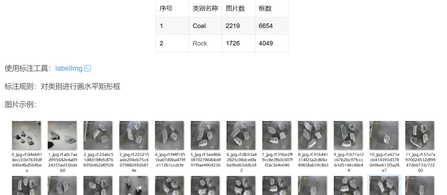

# <Dataset> Coal Gangue Identification Dataset for Object Detection

166.01MB ZIP
The YOLO and VOC formats of the coal gangue dataset are suitable for training models such as the YOLO series, Faster Rcnn, SSD, etc. The categories include: Coal and Rock. The dataset contains 3091 images, along with image files, txt labels, and a YAML file specifying category information, which have been divided into training sets, validation sets, and test sets for direct use in YOLO algorithm training.

## Images

Here is a pay link on Stripe ( https://buy.stripe.com/3cs8yP7sY87d0vu9AB ). Please contact me lonlonago@foxmail.com after funding $89, and I will send you a complete data files , thank you!

